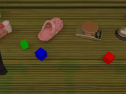
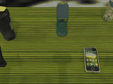
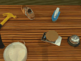
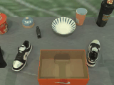

<h1 align="center">
	RoboTwin Dual-Arm Collaboration Challenge<br>2nd MEIS Workshop @ CVPR2025<br>
</h1>


<h2><a href="https://robotwin-benchmark.github.io/cvpr-2025-challenge/">Webpage</a> | <a href="https://developer.d-robotics.cc/en/cvpr-2025-challenge">D-Robotics Cloud Platform</a> | <a href="https://docs.google.com/forms/d/e/1FAIpQLSdibD7TEROlNOO8IFgGmezjUCjELqKHvaUtvj2Nv281hHPZTg/viewform?usp=header">Registration</a></h2> 

Organizers: <a href="https://tianxingchen.github.io">Tianxing Chen</a>, <a href="https://yaomarkmu.github.io/">Yao Mu</a>,  <a href="http://luoping.me/">Ping Luo</a>, <a href="https://english.seiee.sjtu.edu.cn/english/detail/842_802.htm">Xiaokang Yang</a>, <a href="https://www.eecs.utk.edu/people/fei-liu/">Fei Liu</a>, <a href="https://web.stanford.edu/~schwager/">Mac Schwager</a>, <a href="https://www.intelligentrobotics-acrossscales.com/">Dandan Zhang</a>, Zhiqiang Xie, Yusen Qin, <a href="https://dingmyu.github.io/">Mingyu Ding</a>, Zanxin Chen, Kaixuan Wang, Baijun Chen, Ziyuan Liu, Dong Chen.

**RoboTwin 1.0 Version**, accepted to <i style="color: red; display: inline;"><b>CVPR 2025 (Highlight)</b></i>: [Website](https://robotwin-benchmark.github.io/) | [PDF](https://arxiv.org/pdf/2504.13059) | [arXiv](https://arxiv.org/abs/2504.13059)

**RoboTwin Early Version**, accepted to <i><b>ECCV Workshop 2024 (Best Paper)</b></i>: [Webpage](https://robotwin-benchmark.github.io/early-version) | [PDF](https://arxiv.org/pdf/2409.02920) | [arXiv](https://arxiv.org/abs/2409.02920)


**Hardware Support**: AgileX Robotics (松灵机器人)
**Software Support**: D-robotics (地平线地瓜机器人)

**🏆 Awards (Bonus only for Real-world Track)**: 
🥇 First Prize ($1500)
🥈 Second Prize ($1000)
🥉 Third Prize ($500)


# 👌 Important Updates
* **2025/05/09**, We released Round 2 Code (Simulation Track).
* **2025/03/31**, We updated [Guide to debugging evaluation](./evaluation_debugging_image_guide.md) !
* **2025.03.28**, We have released tactile code, please follow the [Install.md](./INSTALL.md). **Please run `script/_download_assets.sh` again**, we have updated the assets for tactile manipulation, which does not affect the rigid object manipulation part.
* **2025.03.20**, We've done the online briefing and released the code. The tactile task code is still pending release.

# 🛠️ Installation
Clone this Repo:
```
git clone -b CVPR-Challenge-2025-Round2 https://github.com/TianxingChen/RoboTwin.git
```

See [INSTALL.md](./INSTALL.md) for installation instructions. The installation process takes about 20 minutes.

# 🧑🏻‍💻 Usage 
## 1. Task Running and Data Collection
Running the following command will first search for a random seed for the target collection quantity (default is 100), and then replay the seed to collect data.

```
bash run_task.sh ${task_name} ${gpu_id}
# As example: bash run_task.sh place_object_scale 0
# - blocks_stack_three
# - blocks_ranking_rgb
# - place_phone_stand
# - place_object_scale
# - dual_shoes_place
```

<table>
  <tr>
    <td></td>
    <td></td>
    <td></td>
  </tr>
  <tr>
    <td></td>
    <td></td>
    <td></td>
  </tr>
</table>

> Notice: the `joint_action` is divided into `left_arm`, `right_arm`, `left_gripper` and `right_gripper`.

An episode's data will be stored in one HDF5 file. Specifically, the images will be stored as bit streams. If you want to recover the image, you can use the following code:

```
image = cv2.imdecode(np.frombuffer(image_bit, np.uint8), cv2.IMREAD_COLOR)
```

The data will be saved to

```
# default file structure
data
└──place_object_scale
  └── __init__.py
  └── aloha-agilex-1-m1_b1_l1_h0.03_c0_D435 # setting
      └── episode0.hdf5
      └── episode0.json
      └── ...
```

> `aloha-agilex-1-m1_b1_l1_h0.03_c0_D435` is a setting, `aloha-agilex-1` indicates embodiment type, `m1` means messy table, `b1` means random background texture, `l1` means random lighting, `h0.03` means the table height will randomly change by  `3cm`, `c0` means camera pose will remain unchanged. All the seeting can be changed by modifying the task config.

**Here is the evaluation setting:**
```
{
    "task_name": null,
    "render_freq": 0,
    "episode_num": null,
    "use_seed": false,
    "save_freq": 10,
    "embodiment": ["aloha-agilex-1"],
    "augmentation": {
      "random_background": true,
      "messy_table": true,
      "clean_background_rate": 0.1,
      "random_head_camera_dis": 0,
      "random_table_height": 0.03,
      "random_light": true,
      "crazy_random_light_rate": 0.1,
      "random_embodiment": false
    },
    "camera": {
      "head_camera_type": "D435",
      "wrist_camera_type": "D435",
      "collect_head_camera": true,
      "collect_wrist_camera": true
    },
    "data_type": {
      "rgb": true,
      "depth": false,
      "observer": false,
      "endpose": false,
      "qpos": true
    },
    "pcd_down_sample_num": 1024,
    "dual_arm": true,
    "pcd_crop": true,
    "save_path": "./data",
    "st_episode": 0,
    "collect_data": true,
    "eval_video_log": true
}
```

Also, language instructions for each episode will be saved in `data/{task_name}/{setting}/episode{idx}.json`.

## 2. Task Config

Data collection configurations are located in the `config` folder, corresponding to each task. 

For the official evaluation, all cameras are designated as D435, and the point cloud is downsampled to 1024 by default. You can see its configuration in `task_config/_camera_config.yml`.

## 3. Deploy your policy

> For competition fairness, the evaluation - platform test seeds are invisible. For the `put_bottles_dustbin` task, bottles may not stand well on the table in some seeds. We've carefully screened the test seeds to avoid this.

Please build your project in the root directory `policy/Your_Policy`. You may change the project folder name if needed.

```
# default file structure
Your_Policy
├── checkpoints
│   └── __init__.py
│   └── ckpt1
│       └── ...
│   └── ckpt2
│       └── ...
├── data
│   └── __init__.py
├── deploy_policy.py
├── deploy_policy.yml
├── eval.sh
├── requirement.txt
└── pyproject.toml
```

For the project environment setup, please use `requirement.txt` or `pyproject.toml` as much as possible. We'll run `pip install -r requirement.txt` and `pip install -e .` by default. If you have special requirements, feel free to contact us via email (`robotwinbenchmark@gmail.com`).

For policy deployment, simply modify the contents of policy/Your-Policy/deploy_policy.py in the root directory according to the instructions. If you encounter any issues or have questions, please submit them as issues.

**Please ensure that the names and parameters of our predefined default functions (`encode_obs`, `get_model`, `eval`, `reset_model`) are not modified.**

```
# deploy_policy.py
# import packages and module here

def encode_obs(observation): # Post-Process Observation
    obs = observation
    # ...
    return obs

def get_model(usr_args): # from your deploy_policy.yml
    return Your_Policy(usr_args) # load your model

def eval(TASK_ENV, model, observation):
    '''
        All the function interfaces below are just examples 
        You can modify them according to your implementation
        But we strongly recommend keeping the code logic unchanged
    '''
    obs = encode_obs(observation) # Post-Process Observation
    instruction = TASK_ENV.get_instruction() # get eval language instruction

    if len(model.obs_cache) == 0: # Force an update of the observation at the first frame to avoid an empty observation window
        model.update_obs(obs)    

    actions = model.get_action() # Get Action according to observation chunk

    for action in actions: # Execute each step of the action
        TASK_ENV.take_action(action)
        observation = TASK_ENV.get_obs()
        obs = encode_obs(observation)
        model.update_obs(obs) # Update Observation

def reset_model(model): # Clean the model cache at the beginning of every evaluation episode, such as the observation window
    pass
```

The `deploy_policy.yml` data will be convert to `get_model` function with `usr_args`. The parameters provided are sufficient for model loading and evaluation, please don't modify the function name and the function parameters.

```
# deploy_policy.yml
# Basic experiment configuration

# modify this !!!!!
policy_name: Your_Policy 
setting: null 

# keep unchanged
task_name: null  
seed: null 
instruction_type: unseen 
expert_data_num: null 
checkpoint_num: null 

# You can add parameters here
# ...
```

You should also modify the `policy_name` in the `eval.sh` to your policy folder name, please keep other code unchanged.
```
#!/bin/bash

policy_name=Your_Policy # modify this
task_name=${1}
seed=${2}
gpu_id=${3}

export CUDA_VISIBLE_DEVICES=${gpu_id}
echo -e "\033[33mgpu id (to use): ${gpu_id}\033[0m"

cd ../.. # move to root

python script/eval_policy.py --config policy/$policy_name/deploy_policy.yml \
    --overrides \
    --task_name ${task_name} \
    --seed ${seed} \
    --policy_name ${policy_name}
```


# 🚴‍♂️ Baselines

## Diffusion Policy (DP)
The DP code can be found in `policy/DP`.

Install DP
```
cd policy/DP
pip install -e .
```

Process Data for DP training after collecting data
```
python process_data.py $task_name $setting $expert_data_num

# As example: python process_data.py place_object_scale aloha-agilex-1-m1_b1_l1_h0.03_c0_D435 100
# which indicates preprocessing of 100 place_object_scale task trajectory data with aloha-agilex-1-m1_b1_l1_h0.03_c0_D435 setting.
```

Run the following code to train DP. The model will be trained for 300 epochs:
```
bash train.sh ${task_name} ${setting} ${expert_data_num} ${seed} ${gpu_id}
# As example: bash train.sh place_object_scale aloha-agilex-1-m1_b1_l1_h0.03_c0_D435 100 0 0
```

Run the following code in the Project Root to evaluate DP for a specific task for 100 times:
```
# modify the `deploy_policy.yml`
as example:
  setting: null -> setting: aloha-agilex-1-m1_b1_l1_h0.03_c0_D435
  expert_data_num: null -> expert_data_num: 100

# run eval_policy.sh
bash eval_policy.sh ${task_name} ${seed} ${gpu_id}
# As example: bash eval_policy.sh place_object_scale 0 0
```

## ACT
```
python process_data.py ${task_name} ${setting} ${expert_data_num}
bash train.sh ${task_name} ${setting} ${expert_data_num} ${seed} ${gpu_id}
bash eval.sh ${task_name} ${seed} ${gpu_id}
# You should also add key `sim-${task_name}-${setting}` to SIM_TASK_CONFIGS in ACT/constants.py and value 'dataset_dir': DATA_DIR + '/sim-${task_name}/${setting}',
```

## RDT
```
process_data_rdt.sh ${task_name} ${setting} ${expert_data_num} ${gpu_id}
generate.sh # see https://github.com/TianxingChen/RoboTwin/tree/main/policy/RDT
finetune.sh # see https://github.com/TianxingChen/RoboTwin/tree/main/policy/RDT
eval.sh
```

# 🏋️ Submit Your Solution

Coming Soon.

# 🚀 Task Information
### blocks_ranking_rgb
At initialization, the three cubes will be randomly placed on the desk. The goal is to sort the cubs so that the colors are red, green, and blue from left to right.

### blocks_stack_three
At initialization, the three cubes will be randomly placed on the desk. The goal is to stack the cubes in the order of: red, green, blue from bottom up. 

### dual_shoes_place
At initialization, the shoes will be randomly placed, and the shoe box will be fixed at a certained location. The goal is to place the shoes in the shoe box, with orientation to the left. 

### put_bottles_dustbin
At initialization, the three bottles will be randomly placed on the desk. The goal is to put the bottles into the trash.

### place_object_scale
At initialization, the object and scale will be randomly placed on the desk. The goal is to place the object on the scale.

### place_phone_stand
At initialization, the phone and phone stand will be randomly placed on the desk. The goal is to place the phone on the phone stand.

# 👍 Citation
If you find our work useful, please consider citing:

RoboTwin: Dual-Arm Robot Benchmark with Generative Digital Twins, accepted to <i style="color: red; display: inline;"><b>CVPR 2025 (Highlight)</b></i>
```
@article{mu2025robotwin,
  title={RoboTwin: Dual-Arm Robot Benchmark with Generative Digital Twins},
  author={Mu, Yao and Chen, Tianxing and Chen, Zanxin and Peng, Shijia and Lan, Zhiqian and Gao, Zeyu and Liang, Zhixuan and Yu, Qiaojun and Zou, Yude and Xu, Mingkun and others},
  journal={arXiv preprint arXiv:2504.13059},
  year={2025}
}
```

RoboTwin: Dual-Arm Robot Benchmark with Generative Digital Twins (**early version**), accepted to <i style="color: red; display: inline;"><b>ECCV Workshop 2024 (Best Paper)</b></i>
```
@article{mu2024robotwin,
  title={RoboTwin: Dual-Arm Robot Benchmark with Generative Digital Twins (early version)},
  author={Mu, Yao and Chen, Tianxing and Peng, Shijia and Chen, Zanxin and Gao, Zeyu and Zou, Yude and Lin, Lunkai and Xie, Zhiqiang and Luo, Ping},
  journal={arXiv preprint arXiv:2409.02920},
  year={2024}
}
```

# 🏷️ License
This repository is released under the MIT license. See [LICENSE](./LICENSE) for additional details.
